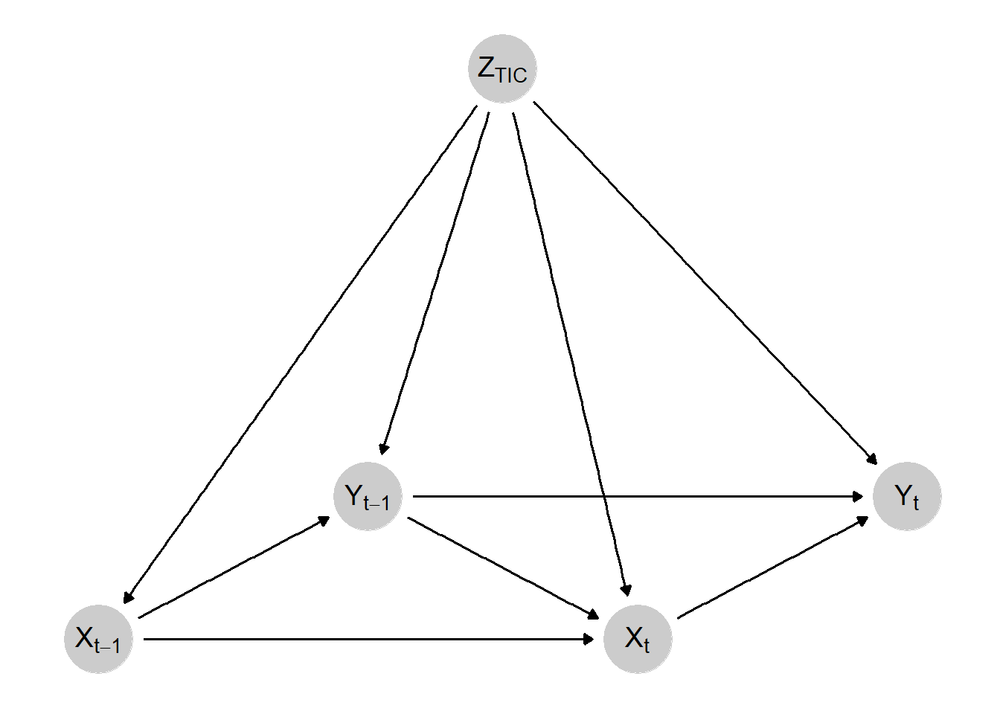
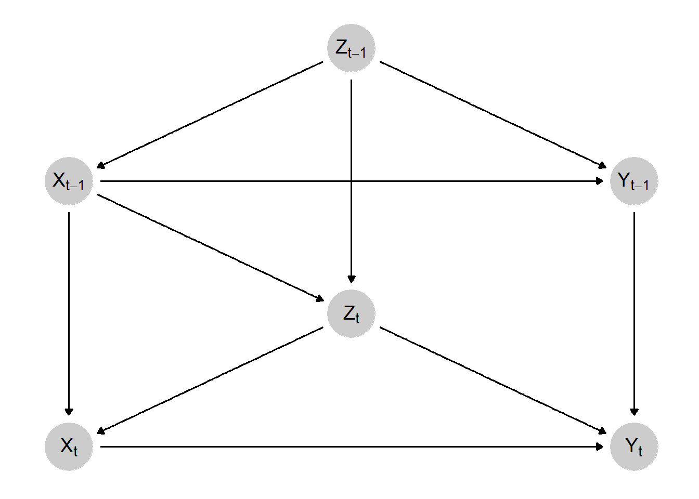
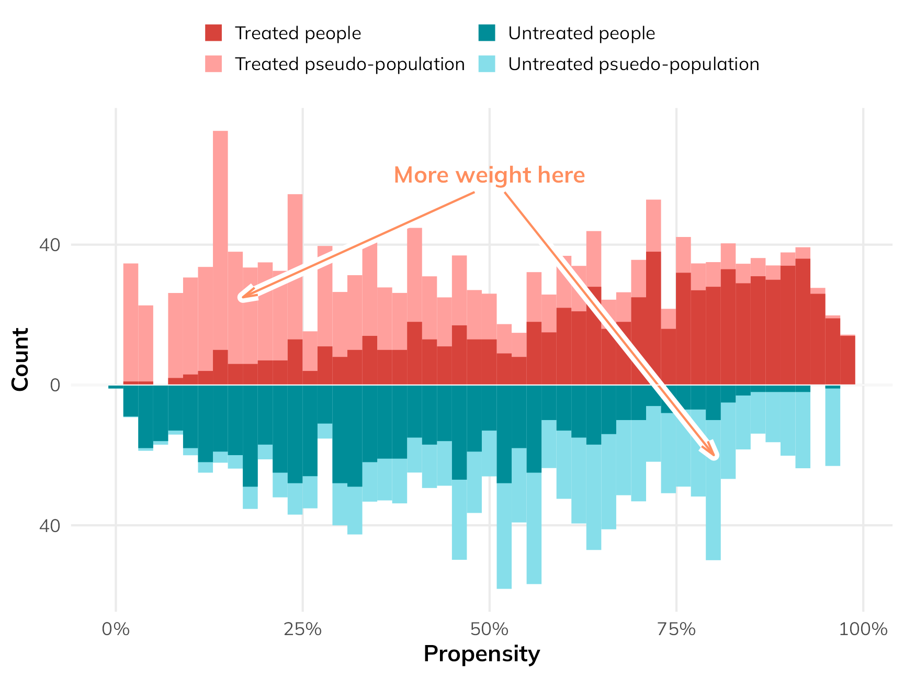

```{r}
#| code-fold: true
#| message: false
#| error: false

pacman::p_load(
  "tidyverse", # Data Manipulation and Visualization
  "marginaleffects", # Marginal Effects
  "vdemdata", # V-Dem Data
  "randomForest", # Random Forests
  "mgcv", # GAMs
  "survey", # Weight Implementation
  install = FALSE
)

# Establish a Custom Color Scheme
colors <- c(
  "#0a697d",
  "#0091af",
  "#ddb067",
  "#d4924a",
  "#c43d56",
  "#ab2a42",
  "#A9A9A9"
)
```

# Intro

I've researched and talked a lot about marginal structural models over the past couple of years. Their application has historically been extremely appropriate for several of my research projects in the past. And, while they might *sound* niche, I don't think they should be treated as such at all since they should be a go-to in many/most panel/longitudinal data settings (more on that later).

What little I've written about marginal structural models has however, been mostly about *why* you should consider them and less about what actually implementing them is like. So I decided to write a blog about this (with a preface that explains what a marginal structural model is and why you might want to use one in the first three sections of this blog). Read onward if you'd like!

# The Problem of Time and Feedback Loops

Most toy causal inference teaching examples ignore time (for good reason). Those examples stick to the comfortable world of the cross-section where we (in theory...) don't have to worry about time. But time is real thing that can't be ignored in most applied research. And when you have data that tracks the same group of units over time, there are some unique challenges that, even today, don't get the attention that they deserve.

Referencing the figures from [a prior blog post](https://brian-lookabaugh.github.io/website-brianlookabaugh/blog/2024/simulating-panel-data/), we can see two ways that time creates serious problems for our abilities to make causal inferences. First, in the figure below, we see a simple DAG that depicts the problem of *feedback loops* between our exposure and outcome. We make a simple assumption that our causal effect of interest is confounded by a single time-invariant confounder. Because it ($Z$) is time-invariant, it impacts all $X$ and $Y$ values across time. Surely, as long as well control for $Z$, we're good, right?



Nope! Take a look at $X_{t}$ and $Y_{t}$ for example. That is the contemporaneous effect (the effect in the current/immediate time period) that we often start with after all. $Z$ does confound this relationship... but *so does* $Y_{t-1}$. That is, prior outcome values impact both current outcome values *and* current exposure values, which go on to impact future outcome values. In other words, we have a feedback loop between our exposure and outcome.

Why is this a problem? Why not control for $Y_{t-1}$ in your regression model? Go ahead, but don't expect that your analysis will be able to estimate any unbiased *lagged* treatment effects. By adjusting for $Y_{t-1}$ you're basically drawing a big red "X" over it. This means that you are blocking the part of the lagged treatment effect that travels to $Y_{t}$ via the $X_{t-1} \rightarrow Y_{t-1} \rightarrow Y_{t}$ path. Okay, so maybe just don't control for $Y_{t-1}$ then? Well, now you've got a *known* confounder of the $X_{t} \rightarrow Y_{t}$ that you aren't adjusting for. Basically, under your standard approaches you'd see in causal inference settings like regression adjustment, matching, fixed effects, etc., you are damned-if-you-do and damned-if-you-don't in this situation.

But what if you don't suspect that such a feedback loops exists? Are you in the clear? Probably not, because time is potentially causing another problem that is demonstrated in the following DAG known as *time-varying confounding* (TVC).



In this scenario, rather than our causal effect of interest being confounded by both a time-invariant confounder plus prior outcome values, our relationship of interest is confounded by a confounder whose value changes over time *and* is influenced by prior exposure values. You might be picking up on where this is going. If we want to estimate the contemporaneous causal effect, we can adjust for $Z_{t}$ with no problems. But what about the lagged treatment effect? Well, you can see how part of this effect travels through: $X_{t-1} \rightarrow Z_{t} \rightarrow Y_{t}$... which means that if we control for $Z_{t}$ to de-confound the contemporaneous treatment effect, we bias the estimation of the lagged treatment effect.

While there's no *guarantee* that your panel/longitudinal/time series cross sectional data set in particular suffers from feedback loops or time-varying confounding, I'd be very shocked if you didn't have at least *one* confounder that didn't exhibit properties such as the one above. And all it takes is one like this to make the estimation of your dynamic causal effects become wrong if you're sticking with the standard toolkit. But thankfully, smart folks have already added to this toolkit to address these problems. And, if you want to get technical, one approach to handle these issues is to estimate a marginal structural model with inverse probability of treatment weights. If you're not familiar with these, that is a lot of technical jargon. So, before moving on towards the implementation of these models, I'm going to work through what these things mean

# What Is an MSM?

A marginal structural model (MSM) is something that you can implement in a wide variety of contexts. They aren't explicitly implemented in the event of feedback loops or time-varying confounding[^1], although they are a core methodology when such issues pop up. Technically, a marginal structural model refers to any statistical model that (forgive my overuse of the word here) *models* the potential outcomes, rather than the observed outcomes... This will make more sense once we start talking about inverse probability weights. But just remember that we *want to know* what the potential outcomes are in any causal project, but how we get there is going to vary.

[^1]: If you want to know more about what I mean here, check out \[Noah Greifer's response\](<https://stats.stackexchange.com/questions/669340/estimating-marginal-structural-models-with-the-weightit-package>) to my question about the {WeightIt} package.

The language here may seem vague, but perhaps we can break down the mystique with a very simplistic and practical example. Say we have an observational cross-section with a binary treatment and a continuous outcome. An MSM allows us to estimate the population-level potential outcome when $X$ = 1 and the potential outcome when $X$ = 0. More interestingly (and applicable for this blog) is that we can also model potential outcomes under different *treatment regimes* over time.

For example, let's say that the aforementioned cross-sectional data set actually is a super short panel where $T$ = 2. We could model the potential outcomes when $X$ = {0, 0}, when $X$ = {0, 1}, when $X$ = {1, 0}, and when $X$ = {1, 1}. We can get an understanding of both *how* we can estimate such potential outcomes and *how* the pesky problems of feedback loops and time-varying confounding are handled by pivoting to the discussion of inverse probability weights.

# How IPW Gets Into the Picture

Inverse probability weighting (IPW) is used for all sorts of stuff. I was complaining earlier that MSMs aren't a core part of the causal inference toolkit yet (even though they should be), but that is not the case for IPW. You can technically use IPWs for all sorts of things[^2], but, to be technically precise, it is inverse probability of treatment weighting (IPTW) that is popular in causal studies. Still, this is a nuance that is already assumed in a causal inference context, so I'm going to refer to them as "IPW"s from now on.

[^2]: \[Chatton and Rohrer (2024) discuss several of these alternative applications such as inverse probability of missigness weights (IPMW) for handling missingness, inverse probability of sampling weights (IPSW) for sampling, and inverse probability of censoring weights (IPCW) for survival analysis.\](<https://psycnet.apa.org/record/2024-71804-001>)

So... what actually is it? The logic is pretty simple. Assume again our handy-dandy binary treatment $X$. Use the confounders that you've identified to build a model to predict whether or not an individual is treated v. untreated. This can literally be `glm(X ~ Z1 + Z2 + Z3, family = binomial(link = "logit"))`. Then, extract the predicted probabilities of treatment status for each individual from the model. Invert these "propensity scores" by computing $\frac{1}{PS}$ (although we'll get into why you can and maybe should make the numerator a little more complicated than just "1") and you've got yourself inverse probability weights. Add these weights into your outcome model via something like this `lm(Y ~ X, weights = ipw` and you've just implemented IPW.

Why go through the steps of modeling the probability of receiving treatment just to invert it? What does that do? By inverting the propensity scores, you are giving more weight to observations that *were confidently predicted to be in a certain treatment status* but *were not observed to be in that treatment status*. For example, let's say that, for Unit A, the predicted probability that $X$ = 1 was 0.78, so 78%. Let's say that Unit A's $X$ value, however, was 0. By taking the inverse of 0.78 ($\frac{1}{1 - 0.78}$), (adding a "1 - " before the propensity score because the unit is not treated), we get an IPW of 4.54. Instead, consider Unit B whose probability of $X$ = 1 was also 0.78, but their treatment status was *actually* 1. We would estimate our IPW by $\frac{1}{0.78}$ and so our IPW would be 1.28. Unit A is going to be weighted much more heavily compared to Unit B and that is by design. The point of IPW is to provide more weight to units that are predicted to have one treatment status but, in actuality, demonstrate another treatment status.

This can be demonstrated visually and, rather than re-invent the wheel, I'm attaching and image from \[Andrew Heiss's blog\](<https://www.andrewheiss.com/blog/2024/03/21/demystifying-ate-att-atu/>) that really communicates what is going on with IPW. The darker colors reflect our actual observed data. The lighter shades reflect what the data looks like after weighting.



You'll notice that the lighter "pseudo-population" looks a lot more balanced than the observed data. Again, this is by design. By using IPWs, we are working with *pseudo-populations* that allow us to approximate the potential outcomes that a marginal structural model seeks to estimate. This means that, in theory, these pseudo-populations are *un-confounded*. In other words, the pseudo-populations that we estimated via IPW reflects what the population-level distribution of $Y$ would look like for each exposure level *if* treatment was randomly assigned. The huge caveat here, just as it exists with regression adjustment or matching, is that our ability to confidently make such a strong claim assumes that we've correctly identified all confounders and identified functional form relationships correctly. That's much easier said than done, but, let's say that if you did that, then IPW can confidently estimate all potential outcomes. This makes IPW a perfect candidate method to *estimate the parameters* of a marginal structural model. The MSM is like the theoretical model that we want to estimate and the IPWs are how we get the MSM.

Now, let's tie everything back together with time. Where does the problem of time fit back into this? First, it's important to know that, for MSMs, we compute IPWs *for each time point*. So, each unit has a lot of different rows under their "IPW" column. That is a *very important aspect*. For each unit at each time period, they receive an IPW, but that IPW is a running product of all IPWs that came before it. For Unit A at time $t$ = 0, the IPW would just be $IPW_{0}$ (where "0" just reflects whatever the IPW happens to be at $t$ = 0). For Unit A at $t$ = 1, the IPW would be $IPW_{0} * IPW_{1}$ and so on and so on. This is computed all the way to the end of your panel until you have one final set of cumulative IPWs for each unit.

Doing this iterative adjustment at each time period is what allows MSMs with IPW to resolve the problem of time-varying confounding and feedback loops that traditional methods struggle to handle. Within each time period, the data is weighted in such a way that (again, assuming all confounders were identified and correctly specified) all contemporaneous and lagged treatment effects are independent of all time-varying and time-invariant confounders *in the pseudo-populations*.[^3] And again, these pseudo-populations show us what the distribution of the potential outcomes would have looked like *if* treatment assignment histories were random instead of confounded.

[^3]: This gets at the idea of MSMs relying on a *sequential ignorability* identification assumption. Basically, if we did our confounder adjustment correctly, then our MSM mimics a sequentially randomized experiment where each unit's treatment status at each time period is totally random and independent of prior exposure, outcome, and confounder values.

With MSMs, there is no issue of adjusting for $Z$ which, in one period is a confounder and in another period is post-treatment, because the IPWs are estimated in such a way that a generic $Z$ (as the strategy of regression adjustment might implicitly treat the confounder) does not exist. All confounders, exposures, and outcomes are indexed by time (i.e. $Z_{t = 0}$, $Z_{t=1}$, etc.). This method actually treats the data as it was represented in the DAGs above. There is no worry that adjusting for $Z$ might de-confound $X_{t} \rightarrow Y_{t}$ while also creating post-treatment bias in the $X_{t-1} \rightarrow Y_{t}$ relationship because $Z$ is adjusted in sequential, separate time periods. There is no universal adjustment that happens to all $Z$ values across time.

# Working with V-Dem

Now that we've established the problem of time in panel/longitudinal/time series cross sectional settings and how MSMs with IPW help us solve for these problems, we can move forward with the more grounded focus of this blog which concerns the actual *implementation* of MSMs. I thought about simulating data for this, but I decided instead to work with actual data for two reasons. First, working with simulated data immediately does the exact opposite of grounding a methods walk through in reality. Second, it quickly became apparent to me that simulating dozens of complex panel data generating processes was a task better suited for something that I would get paid for or for a serious academic project... This is a free blog post and I candidly did not have the time to do a proper simulation study justice in this context...

But we're going with the next best thing which is the Varieties of Democracy (V-Dem) data set! If you're a political scientist, you're already aware of this great resource but, if you're not familiar, it's basically a massive endeavor to measure *everything* related to democracy and political institutions. There's an R package called `{vdemdata}` that lets you automatically download the data set, which is so much easier on me than having to both download and re-upload to GitHub.

I'm not going to go into great detail concerning the variables I'll be using. To be clear, none of the results from this toy example should be taken seriously. I just needed to find an assumed data generating process with feedback loops and time-varying confounding as a template to work through the process of implementing MSMs.

And, with that being explicitly laid out, this toy analysis is going to be looking at the dynamic relationship between civilian mass mobilization (protests, strikes, sit-ins) and government repression. Mass mobilization efforts may decrease repression and increase civil liberties via public pressure. Alternatively, they may also provoke governments to repression in attempts to quell dissent. The regime and the dissidents play an interactive game with each other where their present actions are in response to past actions by the other. This represents a feedback loop that is confounded by several time-varying characteristics. Because it's not important, I won't lay out the theoretical reasoning for the inclusion of each control variable, but it's annotated in the code below if you're interested.

```{r}
vdem_data <- vdem |> 
  select(
    # Identifiers
    country_name, country_id, year, 
    # Exposure - Ordinal Measure of Mass Mobilization
    v2cagenmob_ord,
    # Outcome - Interval Measure of Civil Liberties 
    v2x_civlib,
    # Time-Varying Confounders
    ## Presidential Election Indicator
    v2xel_elecpres,
    ## Legislative Body Election Indicator
    v2xel_elecparl,
    ## Judicial Constraints on the Executive
    v2x_jucon,
    ## Legislative Constraints on the Executive
    v2xlg_legcon,
    ## Media Censorship
    v2mecenefm_ord,
    ## Civil Society Strength and Participation
    v2csprtcpt_ord,
    ## Regime Type (Closed to Autocracy to Open Democracy)
    v2x_regime,
    # (Somewhat) Time-Invariant Confounder
    ## State Capacity Proxy
    v2stfisccap
  ) |> 
  # Modify Certain Variables
  mutate(
    any_election = ifelse(v2xel_elecpres == 1 | v2xel_elecparl == 1, 1, 0),
    state_capacity = ifelse(v2stfisccap > 0, 1, 0),
    # Invert Civil Liberties So That It is Measuring Civil Liberties Violation
    v2x_civlib = 1 - v2x_civlib,
    # Convert Treatment to Binary for Simplistic Purposes
    v2cagenmob_bin = ifelse(v2cagenmob_ord >= 3, 1, 0)
  ) |> 
  # Restrict Analysis to Post-Cold War Era
  filter(year >= 1991) |> 
  select(-c(v2xel_elecpres, v2xel_elecparl, v2stfisccap))
```

# Decision 1: How Far Back Do You Go?

Now we finally get into the meat of this blog! One of the first things you'll need to consider is how far back in time you want to go. By this, I mean two things. First, substantively, how many lagged effects are of interest? If you think the result of an intervention has a large set of lagged effects, how far back can you go before these lagged effects become practically insignificant? Second, do you have a theoretical expectation that, after a certain amount of time has passed *after* an intervention, the effect of the exposure should flip signs? This is an important question to consider, especially when you might expect that an intervention could have a short-term negative effect but a long-term positive effect (or vice versa). If this is the case, it's worth sitting down and giving some thought concerning how many time periods you expect this shift to occur in.

Because, unfortunately, there are significant downsides for choosing a longer causal lag length to study. For one, the greater the causal lag length of interest, the smaller $n$ you have to work with. Consider a panel where $T$ = 20. Say that all you're interested in is the 1-period lagged effect (plus the contemporaneous effect, obviously). This isn't a big deal. Let's say that $t$ starts at 1 in this case. That means you can estimate the effect of $X_{i,t}$ and $X_{i, t-1}$ for every period of $T$ except for where $t$ = 1 (because there's no lagged $X$ at the very beginning of the panel).

In contrast, let's say you were insistent that you wanted to study *five* lagged effects. With a panel of $T$ = 20, we are beginning to seriously trim our data set. That means that, for every observation where $t$ = 1-5, these values are dropped from the data set. The trade-off here is a balance between greater understanding of temporal dynamics and statistical power.

::: callout-important
## Missingness Is a Problem for MSMs...

Given that *time* is a big deal in MSMs, having a random missing observation in the middle of your panel for a given unit is a pretty big deal. Sticking with $T$ = 20, imagine you have one missing value for one of your controls at $t$ = 12 or something like that. Because it's missing, it's dropped from the analysis. Which means that, just assuming that you are estimating a 1-period lagged effect, the moment that you get to $t$ = 13, you can't estimate the 1-period lagged effect, which means that you can't estimate the 1-period lagged effect for $t$ = 14 and so on... Unbalanced panels are a problem, especially when the missingness is not at random because that creates other causal inference issues. So you really just pursue an imputation strategy or just cut your losses and only work with the those observations in the panel prior to the missing value (which, again, could lead to big identification problems).
:::

Another problem with a longer causal lag length is a dimensionality problem. Consider the scenario where we're interested in the causal effect of only 2 time periods, such as the contemporaneous effect and 1-period lagged effect. There's only four counterfactual treatment histories with 2 time periods: {1, 1}, {1, 0}, {0, 1}, and {0, 0}. If we add in just one more lagged effect, we now have the burden of having to estimate the potential outcomes of 8 separate treatment histories. With three lagged effects, we would need to estimate the potential outcomes of 16 separate histories, etc. This is challenging and you begin to stretch the support of your data as this dimensionality curse increases.

Now, let's get to the fun part and look at how effect sizes change when we introduce different lag lengths and use alternative non-MSM methods to get a sense of how much results can change when we use things like regression adjustment, the ADL model, and fixed effects.

```{r}
vdem_data <- vdem_data |> 
  mutate(
    v2cagenmob_bin_lag1 = lag(v2cagenmob_bin, 1),
    v2cagenmob_bin_lag2 = lag(v2cagenmob_bin, 2),
    v2cagenmob_bin_lag3 = lag(v2cagenmob_bin, 3),
    v2x_civlib_lag1 = lag(v2x_civlib, 1)
  )

# Regression Adjustment
ra_model <- lm(v2x_civlib ~ v2cagenmob_bin + v2cagenmob_bin_lag1 + v2cagenmob_bin_lag2 +
                 v2cagenmob_bin_lag3 + any_election + v2x_jucon + v2xlg_legcon +
                 v2mecenefm_ord + v2csprtcpt_ord + state_capacity,
               na.action = na.exclude, data = vdem_data)

ra_ames <- avg_comparisons(ra_model, 
                           variables = c("v2cagenmob_bin", "v2cagenmob_bin_lag1",
                                         "v2cagenmob_bin_lag2", "v2cagenmob_bin_lag3"),
                           newdata = vdem_data,
                           vcov = ~country_id + year)

# ADL
adl_model <- lm(v2x_civlib ~ v2cagenmob_bin + v2cagenmob_bin_lag1 + v2cagenmob_bin_lag2 +
                 v2cagenmob_bin_lag3 + any_election + v2x_jucon + v2xlg_legcon +
                 v2mecenefm_ord + v2csprtcpt_ord + state_capacity + v2x_civlib_lag1,
               na.action = na.exclude, data = vdem_data)

adl_ames <- avg_comparisons(adl_model, 
                           variables = c("v2cagenmob_bin", "v2cagenmob_bin_lag1",
                                         "v2cagenmob_bin_lag2", "v2cagenmob_bin_lag3"),
                           newdata = vdem_data,
                           vcov = ~country_id + year)

# Fixed Effects
fe_model <- lm(v2x_civlib ~ v2cagenmob_bin + v2cagenmob_bin_lag1 + v2cagenmob_bin_lag2 +
                 v2cagenmob_bin_lag3 + any_election + v2x_jucon + v2xlg_legcon +
                 v2mecenefm_ord + v2csprtcpt_ord + state_capacity + v2x_civlib_lag1 +
                 factor(country_id),
               na.action = na.exclude, data = vdem_data)

fe_ames <- avg_comparisons(fe_model, 
                           variables = c("v2cagenmob_bin", "v2cagenmob_bin_lag1",
                                         "v2cagenmob_bin_lag2", "v2cagenmob_bin_lag3"),
                           newdata = vdem_data,
                           vcov = ~country_id + year)

# Two-Way Fixed Effects
twfe_model <- lm(v2x_civlib ~ v2cagenmob_bin + v2cagenmob_bin_lag1 + v2cagenmob_bin_lag2 +
                 v2cagenmob_bin_lag3 + any_election + v2x_jucon + v2xlg_legcon +
                 v2mecenefm_ord + v2csprtcpt_ord + state_capacity + v2x_civlib_lag1 +
                 factor(country_id) + factor(year),
               na.action = na.exclude, data = vdem_data)

twfe_ames <- avg_comparisons(twfe_model, 
                           variables = c("v2cagenmob_bin", "v2cagenmob_bin_lag1",
                                         "v2cagenmob_bin_lag2", "v2cagenmob_bin_lag3"),
                           newdata = vdem_data,
                           vcov = ~country_id + year)

# MSM - 1 Lagged Estimate
## Estimate the Propensity Score Model
ps_mod_lag1 <- glm(v2cagenmob_bin ~ v2cagenmob_bin_lag1 + any_election + v2x_jucon +
                     v2xlg_legcon + v2mecenefm_ord + v2csprtcpt_ord + state_capacity +
                     v2x_civlib_lag1,
                   data = vdem_data,
                   na.action = na.exclude,
                   family = binomial(link = "logit"))

vdem_data_lag1 <- vdem_data |> 
  mutate(
    pscores = fitted(ps_mod_lag1) * v2cagenmob_bin + (1 - fitted(ps_mod_lag1)) * (1 - v2cagenmob_bin),
    ws = 1 / pscores
  ) |> 
  arrange(country_id, year) |> 
  group_by(country_id) |> 
  mutate(cws = cumprod(ws)) |> 
  ungroup()

msm_lag1_model <- lm(v2x_civlib ~ v2cagenmob_bin + v2cagenmob_bin_lag1,
                     data = vdem_data_lag1,
                     weights = cws)

msm_lag1_ames <- avg_comparisons(msm_lag1_model, 
                           variables = c("v2cagenmob_bin", "v2cagenmob_bin_lag1"),
                           newdata = vdem_data_lag1,
                           vcov = ~country_id + year)

# MSM - 2 Lagged Estimates
ps_mod_lag2 <- glm(v2cagenmob_bin ~ v2cagenmob_bin_lag1 + v2cagenmob_bin_lag2 + 
                any_election + v2x_jucon + v2xlg_legcon + v2mecenefm_ord +
                v2csprtcpt_ord + state_capacity + v2x_civlib_lag1,
              data = vdem_data,
              na.action = na.exclude,
              family = binomial(link = "logit"))

vdem_data_lag2 <- vdem_data |> 
  mutate(
    pscores = fitted(ps_mod_lag2) * v2cagenmob_bin + (1 - fitted(ps_mod_lag2)) * (1 - v2cagenmob_bin),
    ws = 1 / pscores
  ) |> 
  arrange(country_id, year) |> 
  group_by(country_id) |> 
  mutate(cws = cumprod(ws)) |> 
  ungroup()

msm_lag2_model <- lm(v2x_civlib ~ v2cagenmob_bin + v2cagenmob_bin_lag1 +
                       v2cagenmob_bin_lag2,
                     data = vdem_data_lag2,
                     weights = cws)

msm_lag2_ames <- avg_comparisons(msm_lag2_model, 
                           variables = c("v2cagenmob_bin", "v2cagenmob_bin_lag1",
                                         "v2cagenmob_bin_lag2"),
                           newdata = vdem_data_lag2,
                           vcov = ~country_id + year)

# MSM - 3 Lagged Estimates
ps_mod_lag3 <- glm(v2cagenmob_bin ~ v2cagenmob_bin_lag1 + v2cagenmob_bin_lag2 + 
                v2cagenmob_bin_lag3 + any_election + v2x_jucon + v2xlg_legcon +
                v2mecenefm_ord + v2csprtcpt_ord + state_capacity + v2x_civlib_lag1,
              data = vdem_data,
              na.action = na.exclude,
              family = binomial(link = "logit"))

vdem_data_lag3 <- vdem_data |> 
  mutate(
    pscores = fitted(ps_mod_lag3) * v2cagenmob_bin + (1 - fitted(ps_mod_lag3)) * (1 - v2cagenmob_bin),
    ws = 1 / pscores
  ) |> 
  arrange(country_id, year) |> 
  group_by(country_id) |> 
  mutate(cws = cumprod(ws)) |> 
  ungroup()

msm_lag3_model <- lm(v2x_civlib ~ v2cagenmob_bin + v2cagenmob_bin_lag1 + v2cagenmob_bin_lag2 +
            v2cagenmob_bin_lag3,
          data = vdem_data_lag3,
          weights = cws)

msm_lag3_ames <- avg_comparisons(msm_lag3_model, 
                           variables = c("v2cagenmob_bin", "v2cagenmob_bin_lag1",
                                         "v2cagenmob_bin_lag2", "v2cagenmob_bin_lag3"),
                           newdata = vdem_data_lag3,
                           vcov = ~country_id + year)

# Store Results
results <- bind_rows(
  # Regression Adjustment
  as.data.frame(ra_ames) |>
    mutate(method = "Regression Adjustment"),
  
  # ADL
  as.data.frame(adl_ames) |>
    mutate(method = "ADL"),
  
  # Fixed Effects
  as.data.frame(fe_ames) |>
    mutate(method = "Fixed Effects"),
  
  # Two-Way Fixed Effects
  as.data.frame(twfe_ames) |>
    mutate(method = "Two-Way Fixed Effects"),
  
  # MSM - 1 Lag
  as.data.frame(msm_lag1_ames) |>
    mutate(method = "MSM - 1 Lag Model"),
  
  # MSM - 2 Lags
  as.data.frame(msm_lag2_ames) |>
    mutate(method = "MSM - 2 Lags Model"),
  
  # MSM - 3 Lags
  as.data.frame(msm_lag3_ames) |>
    mutate(method = "MSM - 3 Lags Model")
) |>
  select(method, term, estimate, conf.low, conf.high)
```

In the figure below, you can see that there is a big gap, *especially* concerning the contemporaneous effect, between the more traditional approaches and the MSM estimates. According to these (extremely untrustworthy and simply toy) results, the MSM generally estimates an immediate response from the state to crack down on civil liberties (in one model) *or* that the state generally gives in to demands (in another model) when there has been many to several small and large scale mass mobilization events. This alone shows why it might be important to be intentional about the number of causal lag lengths you include as moving from modeling 2-year lags to three resulted in a total sign flip for the contemporaneous effect.

```{r fig.height=8, fig.width=10}
#| fig-cap: "ATEs with Different Causal Lag Lengths"
#| code-fold: true
#| message: false
#| error: false
#| results: hide

ggplot(results, aes(x = estimate, y = method, color = method)) +
  geom_point(size = 3) +
  geom_errorbarh(aes(xmin = conf.low, xmax = conf.high), width = 0.25) +
  geom_vline(xintercept = 0, linetype = "dashed", color = "grey40") +
  facet_wrap(~ term, labeller = labeller(term = c(
    "v2cagenmob_bin" = "Contemporaneous Effect",
    "v2cagenmob_bin_lag1" = "1-Year Lag Effect",
    "v2cagenmob_bin_lag2" = "2-Year Lag Effect",
    "v2cagenmob_bin_lag3" = "3-Year Lag Effect"
  ))) +
  labs(
    title = "",
    x = "Average Marginal Effect",
    y = NULL
  ) +
  scale_y_discrete(limits = rev(c("Regression Adjustment", "ADL", "Fixed Effects",
                               "Two-Way Fixed Effects", "MSM - 1 Lag", 
                               "MSM - 2 Lags", "MSM - 3 Lags"))) +
  scale_color_manual(values = c(
    "Regression Adjustment" = colors[5],
    "ADL" = colors[6],
    "Fixed Effects" = colors[3],
    "Two-Way Fixed Effects" = colors[4],
    "MSM - 1 Lag" = colors[1],
    "MSM - 2 Lags" = colors[2],
    "MSM - 3 Lags" = colors[7]
  )) +
  theme_bw() +
  theme(legend.position = "none",
        strip.background = element_rect(fill = "grey90"),
        strip.text = element_text(face = "bold"))
```

The other glaringly obvious difference are those confidence intervals. This is not necessarily a feature of MSMs, but I expected that this would be a feature of *these* MSMs because the weights that we used *were not stabilized*. We took the base inverse of the propensity scores by having "1" in the numerator. In reality, you can actually model the numerator and make it more complex than "1" (hint hint... that is the next part of the blog) and it has the potential to dramatically reduce the variance.

# Decision 2: Stabilizing Your Weights

Using stabilized weights instead is really easy to implement. All we have to do is estimate a separate model for the numerator. In this numerator, we are still going to be in the businesses of fitting propensity scores to predict our exposure. However, instead of including *all* prior exposure values of interest, lagged outcome, time-varying and time-invariant confounders as predictors, we are only going to include lagged exposure values and time-*invariant* confounders as predictors.

```{r}
# MSM - 1 Lagged Estimate
## Estimate the Propensity Score Model
ps_mod_lag1 <- glm(v2cagenmob_bin ~ v2cagenmob_bin_lag1 + any_election + v2x_jucon +
                     v2xlg_legcon + v2mecenefm_ord + v2csprtcpt_ord + state_capacity +
                     v2x_civlib_lag1,
                   data = vdem_data,
                   na.action = na.exclude,
                   family = binomial(link = "logit"))

## Estimate the Numerator Model
ps_num_lag1 <- glm(v2cagenmob_bin ~ v2cagenmob_bin_lag1 + state_capacity,
                   data = vdem_data,
                   na.action = na.exclude,
                   family = binomial(link = "logit"))

vdem_data_lag1 <- vdem_data |> 
  mutate(
    pscores = fitted(ps_mod_lag1) * v2cagenmob_bin + (1 - fitted(ps_mod_lag1)) * (1 - v2cagenmob_bin),
    nscores = fitted(ps_num_lag1) * v2cagenmob_bin + (1 - fitted(ps_num_lag1)) * (1 - v2cagenmob_bin),
    ws = nscores / pscores
  ) |> 
  arrange(country_id, year) |> 
  group_by(country_id) |> 
  mutate(cws = cumprod(ws)) |> 
  ungroup()

msm_lag1_model <- lm(v2x_civlib ~ v2cagenmob_bin + v2cagenmob_bin_lag1,
                     data = vdem_data_lag1,
                     weights = cws)

msm_lag1_ames <- avg_comparisons(msm_lag1_model, 
                           variables = c("v2cagenmob_bin", "v2cagenmob_bin_lag1"),
                           newdata = vdem_data_lag1,
                           vcov = ~country_id + year)

# MSM - 2 Lagged Estimates
ps_mod_lag2 <- glm(v2cagenmob_bin ~ v2cagenmob_bin_lag1 + v2cagenmob_bin_lag2 + 
                any_election + v2x_jucon + v2xlg_legcon + v2mecenefm_ord +
                v2csprtcpt_ord + state_capacity + v2x_civlib_lag1,
              data = vdem_data,
              na.action = na.exclude,
              family = binomial(link = "logit"))

## Estimate the Numerator Model
ps_num_lag2 <- glm(v2cagenmob_bin ~ v2cagenmob_bin_lag1 + v2cagenmob_bin_lag2 +
                     state_capacity,
                   data = vdem_data,
                   na.action = na.exclude,
                   family = binomial(link = "logit"))

vdem_data_lag2 <- vdem_data |> 
  mutate(
    pscores = fitted(ps_mod_lag2) * v2cagenmob_bin + (1 - fitted(ps_mod_lag2)) * (1 - v2cagenmob_bin),
    nscores = fitted(ps_num_lag2) * v2cagenmob_bin + (1 - fitted(ps_num_lag2)) * (1 - v2cagenmob_bin),
    ws = nscores / pscores
  ) |> 
  arrange(country_id, year) |> 
  group_by(country_id) |> 
  mutate(cws = cumprod(ws)) |> 
  ungroup()

msm_lag2_model <- lm(v2x_civlib ~ v2cagenmob_bin + v2cagenmob_bin_lag1 +
                       v2cagenmob_bin_lag2,
                     data = vdem_data_lag2,
                     weights = cws)

msm_lag2_ames <- avg_comparisons(msm_lag2_model, 
                           variables = c("v2cagenmob_bin", "v2cagenmob_bin_lag1",
                                         "v2cagenmob_bin_lag2"),
                           newdata = vdem_data_lag2,
                           vcov = ~country_id + year)

# MSM - 3 Lagged Estimates
ps_mod_lag3 <- glm(v2cagenmob_bin ~ v2cagenmob_bin_lag1 + v2cagenmob_bin_lag2 + 
                v2cagenmob_bin_lag3 + any_election + v2x_jucon + v2xlg_legcon +
                v2mecenefm_ord + v2csprtcpt_ord + state_capacity + v2x_civlib_lag1,
              data = vdem_data,
              na.action = na.exclude,
              family = binomial(link = "logit"))

## Estimate the Numerator Model
ps_num_lag3 <- glm(v2cagenmob_bin ~ v2cagenmob_bin_lag1 + v2cagenmob_bin_lag2 +
                     v2cagenmob_bin_lag3 + state_capacity,
                   data = vdem_data,
                   na.action = na.exclude,
                   family = binomial(link = "logit"))

vdem_data_lag3 <- vdem_data |> 
  mutate(
    pscores = fitted(ps_mod_lag3) * v2cagenmob_bin + (1 - fitted(ps_mod_lag3)) * (1 - v2cagenmob_bin),
    nscores = fitted(ps_num_lag3) * v2cagenmob_bin + (1 - fitted(ps_num_lag3)) * (1 - v2cagenmob_bin),
    ws = nscores / pscores
  ) |> 
  arrange(country_id, year) |> 
  group_by(country_id) |> 
  mutate(cws = cumprod(ws)) |> 
  ungroup()

msm_lag3_model <- lm(v2x_civlib ~ v2cagenmob_bin + v2cagenmob_bin_lag1 + v2cagenmob_bin_lag2 +
            v2cagenmob_bin_lag3,
          data = vdem_data_lag3,
          weights = cws)

msm_lag3_ames <- avg_comparisons(msm_lag3_model, 
                           variables = c("v2cagenmob_bin", "v2cagenmob_bin_lag1",
                                         "v2cagenmob_bin_lag2", "v2cagenmob_bin_lag3"),
                           newdata = vdem_data_lag3,
                           vcov = ~country_id + year)

# Store Results
results <- bind_rows(
  # Regression Adjustment
  as.data.frame(ra_ames) |>
    mutate(method = "Regression Adjustment"),
  
  # ADL
  as.data.frame(adl_ames) |>
    mutate(method = "ADL"),
  
  # Fixed Effects
  as.data.frame(fe_ames) |>
    mutate(method = "Fixed Effects"),
  
  # Two-Way Fixed Effects
  as.data.frame(twfe_ames) |>
    mutate(method = "Two-Way Fixed Effects"),
  
  # MSM - 1 Lag
  as.data.frame(msm_lag1_ames) |>
    mutate(method = "MSM - 1 Lag Model"),
  
  # MSM - 2 Lags
  as.data.frame(msm_lag2_ames) |>
    mutate(method = "MSM - 2 Lags Model"),
  
  # MSM - 3 Lags
  as.data.frame(msm_lag3_ames) |>
    mutate(method = "MSM - 3 Lags Model")
) |>
  select(method, term, estimate, conf.low, conf.high)
```

Interesting results below. Don't be fooled by the scaling of the plot. If you pay attention to the x-axis marginal effects, you'll notice that these confidence intervals have dramatically shrunk... along with the point estimates. These results suggest that our initial findings generated from the unstabilized weights were a bit unwieldy and sensitive to extreme weights that were generated by taking the simple inverse of the propensity score. This easy, and recommended, practical step led to a major change in the results, so this step definitely should not be considered as a minor, cosmetic change.

```{r fig.height=8, fig.width=10}
#| fig-cap: "ATEs with Stabilized Weights"
#| code-fold: true
#| message: false
#| error: false
#| results: hide

ggplot(results, aes(x = estimate, y = method, color = method)) +
  geom_point(size = 3) +
  geom_errorbarh(aes(xmin = conf.low, xmax = conf.high), width = 0.25) +
  geom_vline(xintercept = 0, linetype = "dashed", color = "grey40") +
  facet_wrap(~ term, labeller = labeller(term = c(
    "v2cagenmob_bin" = "Contemporaneous Effect",
    "v2cagenmob_bin_lag1" = "1-Year Lag Effect",
    "v2cagenmob_bin_lag2" = "2-Year Lag Effect",
    "v2cagenmob_bin_lag3" = "3-Year Lag Effect"
  ))) +
  labs(
    title = "",
    x = "Average Marginal Effect",
    y = NULL
  ) +
  scale_y_discrete(limits = rev(c("Regression Adjustment", "ADL", "Fixed Effects",
                               "Two-Way Fixed Effects", "MSM - 1 Lag Model", 
                               "MSM - 2 Lags Model", "MSM - 3 Lags Model"))) +
  scale_color_manual(values = c(
    "Regression Adjustment" = colors[5],
    "ADL" = colors[6],
    "Fixed Effects" = colors[3],
    "Two-Way Fixed Effects" = colors[4],
    "MSM - 1 Lag Model" = colors[1],
    "MSM - 2 Lags Model" = colors[2],
    "MSM - 3 Lags Model" = colors[7]
  )) +
  theme_bw() +
  theme(legend.position = "none",
        strip.background = element_rect(fill = "grey90"),
        strip.text = element_text(face = "bold"))
```

# Decision 3: Dealing with Extreme Weights

If you're still concerned about large weights *after* stabilization (which can still be a problem), another practical decision to make is whether or not you'll pursue *truncation* as an additional strategy. Post-stabilization, you might still end up with some extreme weights that are dominating the analysis. Truncation is a strategy to re-code the weights for some units in the analysis at an arbitrary threshold, such as the 1% most extreme (so the 0.5% largest and 0.5% smallest), or the 5% most extreme (so the 2.5% largest and 2.5% smallest) weights.

For example, if you decided to do pursue 5% truncation and the 97.5% largest IPW was 2.5, then any IPW greater than 2.5 would be re-coded to 2.5. Similarly, if the 2.5% smallest IPW was 0.02, then all IPWs smaller than 0.02 would be re-coded to 0.02. Such strategy should generally decrease the variance as you increase the truncation, because you are artificially re-coding the most extreme weights. The downside to this is that you are increasing bias because, even though these crazy IPWs are creating *statistical* problems for us, they are (assuming you identified all the confounders and adjusted for them in the correct way...), they are assumed to be *correct*. If that's true, we're basically injecting bias for convenience. So this is a trade-off you'll need to evaluate carefully.

As mentioned earlier, one way to navigate this is to see how much results change as you artificially increase the truncation rule. Truncating 1% might be sufficient to decrease the variance without inducing much bias. Or it might be 2%... or 0.05%...

::: callout-note
## Why Re-Code Instead of Drop?

I can see why some might think that re-coding extreme IPWs might be "cheating". If extreme weights are causing that many problems, why not just drop them rather than setting them to a *known* incorrect value? There's two responses to this. First, as mentioned earlier, dropping observations from your analysis does not solve any problem and can substantially increase bias. Second, because weights are a *cumulative product* of (current weights \* all prior weights), "dropping" a single extreme weight in the treatment history omits *all future weights in the treatment sequence*. So that's not good either...
:::

Now, let's see if the results changed any by doing 1% and 5% truncation on our stabilized weights!

```{r}
# Lag 1 Models
vdem_data_lag1 <- vdem_data |> 
  mutate(
    pscores = fitted(ps_mod_lag1) * v2cagenmob_bin + (1 - fitted(ps_mod_lag1)) * (1 - v2cagenmob_bin),
    nscores = fitted(ps_num_lag1) * v2cagenmob_bin + (1 - fitted(ps_num_lag1)) * (1 - v2cagenmob_bin),
    ws_notrunc = nscores / pscores,
    ws_1trunc = pmin(pmax(ws_notrunc, quantile(ws_notrunc, 0.005, na.rm = TRUE)), quantile(ws_notrunc, 0.995, na.rm = TRUE)),
    ws_5trunc = pmin(pmax(ws_notrunc, quantile(ws_notrunc, 0.025, na.rm = TRUE)), quantile(ws_notrunc, 0.975, na.rm = TRUE))
  ) |> 
  arrange(country_id, year) |> 
  group_by(country_id) |> 
  mutate(
    cws_notrunc = cumprod(ws_notrunc),
    cws_1trunc = cumprod(ws_1trunc),
    cws_5trunc = cumprod(ws_5trunc)
  ) |> 
  ungroup()

msm_lag1_model_notrunc <- lm(v2x_civlib ~ v2cagenmob_bin + v2cagenmob_bin_lag1,
                     data = vdem_data_lag1,
                     weights = cws_notrunc)

msm_lag1_ames_notrunc <- avg_comparisons(msm_lag1_model_notrunc, 
                           variables = c("v2cagenmob_bin", "v2cagenmob_bin_lag1"),
                           newdata = vdem_data_lag1,
                           vcov = ~country_id + year)

msm_lag1_model_1trunc <- lm(v2x_civlib ~ v2cagenmob_bin + v2cagenmob_bin_lag1,
                     data = vdem_data_lag1,
                     weights = cws_1trunc)

msm_lag1_ames_1trunc <- avg_comparisons(msm_lag1_model_1trunc, 
                           variables = c("v2cagenmob_bin", "v2cagenmob_bin_lag1"),
                           newdata = vdem_data_lag1,
                           vcov = ~country_id + year)

msm_lag1_model_5trunc <- lm(v2x_civlib ~ v2cagenmob_bin + v2cagenmob_bin_lag1,
                     data = vdem_data_lag1,
                     weights = cws_5trunc)

msm_lag1_ames_5trunc <- avg_comparisons(msm_lag1_model_5trunc, 
                           variables = c("v2cagenmob_bin", "v2cagenmob_bin_lag1"),
                           newdata = vdem_data_lag1,
                           vcov = ~country_id + year)

# Lag 2 Models
vdem_data_lag2 <- vdem_data |> 
  mutate(
    pscores = fitted(ps_mod_lag2) * v2cagenmob_bin + (1 - fitted(ps_mod_lag2)) * (1 - v2cagenmob_bin),
    nscores = fitted(ps_num_lag2) * v2cagenmob_bin + (1 - fitted(ps_num_lag2)) * (1 - v2cagenmob_bin),
    ws_notrunc = nscores / pscores,
    ws_1trunc = pmin(pmax(ws_notrunc, quantile(ws_notrunc, 0.005, na.rm = TRUE)), quantile(ws_notrunc, 0.995, na.rm = TRUE)),
    ws_5trunc = pmin(pmax(ws_notrunc, quantile(ws_notrunc, 0.025, na.rm = TRUE)), quantile(ws_notrunc, 0.975, na.rm = TRUE))
  ) |> 
  arrange(country_id, year) |> 
  group_by(country_id) |> 
  mutate(
    cws_notrunc = cumprod(ws_notrunc),
    cws_1trunc = cumprod(ws_1trunc),
    cws_5trunc = cumprod(ws_5trunc)
  ) |> 
  ungroup()

msm_lag2_model_notrunc <- lm(v2x_civlib ~ v2cagenmob_bin + v2cagenmob_bin_lag1 +
                               v2cagenmob_bin_lag2,
                     data = vdem_data_lag2,
                     weights = cws_notrunc)

msm_lag2_ames_notrunc <- avg_comparisons(msm_lag2_model_notrunc, 
                           variables = c("v2cagenmob_bin", "v2cagenmob_bin_lag1",
                                         "v2cagenmob_bin_lag2"),
                           newdata = vdem_data_lag2,
                           vcov = ~country_id + year)

msm_lag2_model_1trunc <- lm(v2x_civlib ~ v2cagenmob_bin + v2cagenmob_bin_lag1 +
                              v2cagenmob_bin_lag2,
                     data = vdem_data_lag2,
                     weights = cws_1trunc)

msm_lag2_ames_1trunc <- avg_comparisons(msm_lag2_model_1trunc, 
                           variables = c("v2cagenmob_bin", "v2cagenmob_bin_lag1",
                                         "v2cagenmob_bin_lag2"),
                           newdata = vdem_data_lag2,
                           vcov = ~country_id + year)

msm_lag2_model_5trunc <- lm(v2x_civlib ~ v2cagenmob_bin + v2cagenmob_bin_lag1 +
                              v2cagenmob_bin_lag2,
                     data = vdem_data_lag2,
                     weights = cws_5trunc)

msm_lag2_ames_5trunc <- avg_comparisons(msm_lag2_model_5trunc, 
                           variables = c("v2cagenmob_bin", "v2cagenmob_bin_lag1",
                                         "v2cagenmob_bin_lag2"),
                           newdata = vdem_data_lag2,
                           vcov = ~country_id + year)

# Lag 3 Models
vdem_data_lag3 <- vdem_data |> 
  mutate(
    pscores = fitted(ps_mod_lag3) * v2cagenmob_bin + (1 - fitted(ps_mod_lag3)) * (1 - v2cagenmob_bin),
    nscores = fitted(ps_num_lag3) * v2cagenmob_bin + (1 - fitted(ps_num_lag3)) * (1 - v2cagenmob_bin),
    ws_notrunc = nscores / pscores,
    ws_1trunc = pmin(pmax(ws_notrunc, quantile(ws_notrunc, 0.005, na.rm = TRUE)), quantile(ws_notrunc, 0.995, na.rm = TRUE)),
    ws_5trunc = pmin(pmax(ws_notrunc, quantile(ws_notrunc, 0.025, na.rm = TRUE)), quantile(ws_notrunc, 0.975, na.rm = TRUE))
  ) |> 
  arrange(country_id, year) |> 
  group_by(country_id) |> 
  mutate(
    cws_notrunc = cumprod(ws_notrunc),
    cws_1trunc = cumprod(ws_1trunc),
    cws_5trunc = cumprod(ws_5trunc)
  ) |> 
  ungroup()

msm_lag3_model_notrunc <- lm(v2x_civlib ~ v2cagenmob_bin + v2cagenmob_bin_lag1 +
                               v2cagenmob_bin_lag2 + v2cagenmob_bin_lag3,
                     data = vdem_data_lag3,
                     weights = cws_notrunc)

msm_lag3_ames_notrunc <- avg_comparisons(msm_lag3_model_notrunc, 
                           variables = c("v2cagenmob_bin", "v2cagenmob_bin_lag1",
                                         "v2cagenmob_bin_lag2", "v2cagenmob_bin_lag3"),
                           newdata = vdem_data_lag3,
                           vcov = ~country_id + year)

msm_lag3_model_1trunc <- lm(v2x_civlib ~ v2cagenmob_bin + v2cagenmob_bin_lag1 +
                              v2cagenmob_bin_lag2 + v2cagenmob_bin_lag3,
                     data = vdem_data_lag3,
                     weights = cws_1trunc)

msm_lag3_ames_1trunc <- avg_comparisons(msm_lag3_model_1trunc, 
                           variables = c("v2cagenmob_bin", "v2cagenmob_bin_lag1",
                                         "v2cagenmob_bin_lag2", "v2cagenmob_bin_lag3"),
                           newdata = vdem_data_lag3,
                           vcov = ~country_id + year)

msm_lag3_model_5trunc <- lm(v2x_civlib ~ v2cagenmob_bin + v2cagenmob_bin_lag1 +
                              v2cagenmob_bin_lag2 + v2cagenmob_bin_lag3,
                     data = vdem_data_lag3,
                     weights = cws_5trunc)

msm_lag3_ames_5trunc <- avg_comparisons(msm_lag3_model_5trunc, 
                           variables = c("v2cagenmob_bin", "v2cagenmob_bin_lag1",
                                         "v2cagenmob_bin_lag2", "v2cagenmob_bin_lag3"),
                           newdata = vdem_data_lag3,
                           vcov = ~country_id + year)

# Store Results
results <- bind_rows(
  # MSM - 1 Lag
  as.data.frame(msm_lag1_ames_notrunc) |>
    mutate(method = "1 Lag (No Truncation)"),
  as.data.frame(msm_lag1_ames_1trunc) |>
    mutate(method = "1 Lag (1% Truncation)"),
  as.data.frame(msm_lag1_ames_5trunc) |>
    mutate(method = "1 Lag (5% Truncation)"),
  
  # MSM - 2 Lags
  as.data.frame(msm_lag2_ames_notrunc) |>
    mutate(method = "2 Lags (No Truncation)"),
  as.data.frame(msm_lag2_ames_1trunc) |>
    mutate(method = "2 Lags (1% Truncation)"),
  as.data.frame(msm_lag2_ames_5trunc) |>
    mutate(method = "2 Lags (5% Truncation)"),
  
  # MSM - 3 Lags
  as.data.frame(msm_lag3_ames_notrunc) |>
    mutate(method = "3 Lags (No Truncation)"),
  as.data.frame(msm_lag3_ames_1trunc) |>
    mutate(method = "3 Lags (1% Truncation)"),
  as.data.frame(msm_lag3_ames_5trunc) |>
    mutate(method = "3 Lags (5% Truncation)")
) |>
  select(method, term, estimate, conf.low, conf.high)
```

Below, we can see that truncation seems to help a bit with precision. When comparing the same lagged model that uses truncation v. those that don't, we do see that confidence intervals shrink a bit, *especially* for the estimation of lagged effects, and that point estimates are pushed towards zero. Is this push towards zero a result of noisy results being "regularized" or is it a sign of bias injected into the point estimates? I don't know! Again, truncation requires careful evaluation and being honest about the trade-offs.

```{r fig.height=8, fig.width=10}
#| fig-cap: "ATEs with Stabilized Weights and Truncation"
#| code-fold: true
#| message: false
#| error: false
#| results: hide

ggplot(results, aes(x = estimate, y = method, color = method)) +
  geom_point(size = 3) +
  geom_errorbarh(aes(xmin = conf.low, xmax = conf.high), width = 0.25) +
  geom_vline(xintercept = 0, linetype = "dashed", color = "grey40") +
  facet_wrap(~ term, labeller = labeller(term = c(
    "v2cagenmob_bin" = "Contemporaneous Effect",
    "v2cagenmob_bin_lag1" = "1-Year Lag Effect",
    "v2cagenmob_bin_lag2" = "2-Year Lag Effect",
    "v2cagenmob_bin_lag3" = "3-Year Lag Effect"
  ))) +
  labs(
    x = "Average Marginal Effect",
    y = NULL
  ) +
  scale_y_discrete(limits = rev(c(
    "1 Lag (No Truncation)", "1 Lag (1% Truncation)", "1 Lag (5% Truncation)",
    "2 Lags (No Truncation)", "2 Lags (1% Truncation)", "2 Lags (5% Truncation)",
    "3 Lags (No Truncation)", "3 Lags (1% Truncation)", "3 Lags (5% Truncation)"
  ))) +
  scale_color_manual(values = c(
    "1 Lag (No Truncation)" = colors[1],
    "2 Lags (No Truncation)" = colors[2],
    "3 Lags (No Truncation)" = colors[7],
    "1 Lag (1% Truncation)" = colors[1],
    "2 Lags (1% Truncation)" = colors[2],
    "3 Lags (1% Truncation)" = colors[7],
    "1 Lag (5% Truncation)" = colors[1],
    "2 Lags (5% Truncation)" = colors[2],
    "3 Lags (5% Truncation)" = colors[7]
  )) +
  theme_bw() +
  theme(legend.position = "none",
        strip.background = element_rect(fill = "grey90"),
        strip.text = element_text(face = "bold"))
```

# Decision 4: There's More Than Just Logistic Regression

So far, every propensity score that we've estimated has been from logistic regression. This is sort of the norm, but necessarily the standard. It's easy to just use logit as a default because it's easy to implement and we're all familiar with it. However, such convenience should be confronted. After all, with MSMs, we not only need to identify the correct adjustment set of controls to de-bias our estimates, we also need to make sure that we are modeling these in the correct way. It's easy to code up an additive logit model, but there's probably all sorts of non-linear effects going on that impact treatment assignment. An additive logit model is probably not always the best for modeling such complexities.

Let's see how results change when we use two alternative methods; a Generalized Additive Model (GAM) and a Random Forest machine learning algorithm. These two approaches are known to be much more flexible than a standard generalized linear model like logistic regression. Still, it's important to know that what I'm testing here isn't exhaustive by any means. You could make your propensity score algorithm more flexible by also including non-linear terms in your standard logit (like interactions and polynomials), by using other machine learning algorithms, or by implementing algorithms specifically designed for predicting the correct propensity score, such as the Covariate Balancing Propensity Score (CBPS).

```{r}
# Estimate Results with Random Forest
## Lag 1
ps_mod_lag1_rf <- randomForest(factor(v2cagenmob_bin) ~ v2cagenmob_bin_lag1 + any_election + v2x_jucon +
                     v2xlg_legcon + v2mecenefm_ord + v2csprtcpt_ord + state_capacity +
                     v2x_civlib_lag1,
                   data = vdem_data,
                   na.action = na.omit)

ps_num_lag1_rf <- randomForest(factor(v2cagenmob_bin) ~ v2cagenmob_bin_lag1 + state_capacity,
                   data = vdem_data,
                   na.action = na.omit)

vdem_data_lag1_rf <- vdem_data |> 
  mutate(
    pscores = predict(ps_mod_lag1_rf, newdata = vdem_data, type = "prob")[, "1"] * v2cagenmob_bin + (1 - predict(ps_mod_lag1_rf, newdata = vdem_data, type = "prob")[, "1"]) * (1 - v2cagenmob_bin),
    nscores = predict(ps_num_lag1_rf, newdata = vdem_data, type = "prob")[, "1"] * v2cagenmob_bin + (1 - predict(ps_num_lag1_rf, newdata = vdem_data, type = "prob")[, "1"]) * (1 - v2cagenmob_bin),
    ws = nscores / pscores
  ) |> 
  arrange(country_id, year) |> 
  group_by(country_id) |> 
  mutate(cws = cumprod(ws)) |> 
  ungroup()

msm_lag1_model_rf <- lm(v2x_civlib ~ v2cagenmob_bin + v2cagenmob_bin_lag1,
                     data = vdem_data_lag1_rf,
                     weights = cws)

msm_lag1_ames_rf <- avg_comparisons(msm_lag1_model_rf, 
                           variables = c("v2cagenmob_bin", "v2cagenmob_bin_lag1"),
                           newdata = vdem_data_lag1_rf,
                           vcov = ~country_id + year)

## Lag 2
ps_mod_lag2_rf <- randomForest(factor(v2cagenmob_bin) ~ v2cagenmob_bin_lag1 + 
                                 v2cagenmob_bin_lag2 + any_election + v2x_jucon +
                     v2xlg_legcon + v2mecenefm_ord + v2csprtcpt_ord + state_capacity +
                     v2x_civlib_lag1,
                   data = vdem_data,
                   na.action = na.omit)

ps_num_lag2_rf <- randomForest(factor(v2cagenmob_bin) ~ v2cagenmob_bin_lag1 + v2cagenmob_bin_lag2 + state_capacity,
                   data = vdem_data,
                   na.action = na.omit)

vdem_data_lag2_rf <- vdem_data |> 
  mutate(
    pscores = predict(ps_mod_lag2_rf, newdata = vdem_data, type = "prob")[, "1"] * v2cagenmob_bin + (1 - predict(ps_mod_lag2_rf, newdata = vdem_data, type = "prob")[, "1"]) * (1 - v2cagenmob_bin),
    nscores = predict(ps_num_lag2_rf, newdata = vdem_data, type = "prob")[, "1"] * v2cagenmob_bin + (1 - predict(ps_num_lag2_rf, newdata = vdem_data, type = "prob")[, "1"]) * (1 - v2cagenmob_bin),
    ws = nscores / pscores
  ) |> 
  arrange(country_id, year) |> 
  group_by(country_id) |> 
  mutate(cws = cumprod(ws)) |> 
  ungroup()

msm_lag2_model_rf <- lm(v2x_civlib ~ v2cagenmob_bin + v2cagenmob_bin_lag1 + v2cagenmob_bin_lag2,
                     data = vdem_data_lag2_rf,
                     weights = cws)

msm_lag2_ames_rf <- avg_comparisons(msm_lag2_model_rf, 
                           variables = c("v2cagenmob_bin", "v2cagenmob_bin_lag1",
                                         "v2cagenmob_bin_lag2"),
                           newdata = vdem_data_lag2_rf,
                           vcov = ~country_id + year)

## Lag 3
ps_mod_lag3_rf <- randomForest(factor(v2cagenmob_bin) ~ v2cagenmob_bin_lag1 + 
                                 v2cagenmob_bin_lag2 + v2cagenmob_bin_lag3 + any_election + v2x_jucon +
                     v2xlg_legcon + v2mecenefm_ord + v2csprtcpt_ord + state_capacity +
                     v2x_civlib_lag1,
                   data = vdem_data,
                   na.action = na.omit)

ps_num_lag3_rf <- randomForest(factor(v2cagenmob_bin) ~ v2cagenmob_bin_lag1 + v2cagenmob_bin_lag2 + + v2cagenmob_bin_lag3 + state_capacity,
                   data = vdem_data,
                   na.action = na.omit)

vdem_data_lag3_rf <- vdem_data |> 
  mutate(
    pscores = predict(ps_mod_lag3_rf, newdata = vdem_data, type = "prob")[, "1"] * v2cagenmob_bin + (1 - predict(ps_mod_lag3_rf, newdata = vdem_data, type = "prob")[, "1"]) * (1 - v2cagenmob_bin),
    nscores = predict(ps_num_lag3_rf, newdata = vdem_data, type = "prob")[, "1"] * v2cagenmob_bin + (1 - predict(ps_num_lag3_rf, newdata = vdem_data, type = "prob")[, "1"]) * (1 - v2cagenmob_bin),
    ws = nscores / pscores
  ) |> 
  arrange(country_id, year) |> 
  group_by(country_id) |> 
  mutate(cws = cumprod(ws)) |> 
  ungroup()

msm_lag3_model_rf <- lm(v2x_civlib ~ v2cagenmob_bin + v2cagenmob_bin_lag1 + v2cagenmob_bin_lag2 + v2cagenmob_bin_lag3,
                     data = vdem_data_lag3_rf,
                     weights = cws)

msm_lag3_ames_rf <- avg_comparisons(msm_lag3_model_rf, 
                           variables = c("v2cagenmob_bin", "v2cagenmob_bin_lag1",
                                         "v2cagenmob_bin_lag2", "v2cagenmob_bin_lag3"),
                           newdata = vdem_data_lag3_rf,
                           vcov = ~country_id + year)

# Estimate Results with GAMs
## Lag 1
ps_mod_lag1_gam <- gam(v2cagenmob_bin ~ v2cagenmob_bin_lag1 + any_election + s(v2x_jucon) +
                     s(v2xlg_legcon) + v2mecenefm_ord + v2csprtcpt_ord + state_capacity +
                     s(v2x_civlib_lag1),
                   data = vdem_data,
                   na.action = na.exclude,
                   family = binomial(link = "logit"))

ps_num_lag1 <- glm(v2cagenmob_bin ~ v2cagenmob_bin_lag1 + state_capacity,
                   data = vdem_data,
                   na.action = na.exclude,
                   family = binomial(link = "logit"))

vdem_data_lag1_gam <- vdem_data |> 
  mutate(
    pscores = fitted(ps_mod_lag1_gam) * v2cagenmob_bin + (1 - fitted(ps_mod_lag1_gam)) * (1 - v2cagenmob_bin),
    nscores = fitted(ps_num_lag1) * v2cagenmob_bin + (1 - fitted(ps_num_lag1)) * (1 - v2cagenmob_bin),
    ws = nscores / pscores
  ) |> 
  arrange(country_id, year) |> 
  group_by(country_id) |> 
  mutate(cws = cumprod(ws)) |> 
  ungroup()

msm_lag1_model_gam <- lm(v2x_civlib ~ v2cagenmob_bin + v2cagenmob_bin_lag1,
                     data = vdem_data_lag1_gam,
                     weights = cws)

msm_lag1_ames_gam <- avg_comparisons(msm_lag1_model_gam, 
                           variables = c("v2cagenmob_bin", "v2cagenmob_bin_lag1"),
                           newdata = vdem_data_lag1_gam,
                           vcov = ~country_id + year)

## Lag 2
ps_mod_lag2_gam <- gam(v2cagenmob_bin ~ v2cagenmob_bin_lag1 + 
                                 v2cagenmob_bin_lag2 + any_election + s(v2x_jucon) +
                     s(v2xlg_legcon) + v2mecenefm_ord + v2csprtcpt_ord + state_capacity +
                     s(v2x_civlib_lag1),
                   data = vdem_data,
                   na.action = na.exclude,
                   family = binomial(link = "logit"))

ps_num_lag2 <- glm(v2cagenmob_bin ~ v2cagenmob_bin_lag1 + v2cagenmob_bin_lag2 + state_capacity,
                   data = vdem_data,
                   na.action = na.exclude,
                   family = binomial(link = "logit"))

vdem_data_lag2_gam <- vdem_data |> 
  mutate(
    pscores = fitted(ps_mod_lag2_gam) * v2cagenmob_bin + (1 - fitted(ps_mod_lag2_gam)) * (1 - v2cagenmob_bin),
    nscores = fitted(ps_num_lag2) * v2cagenmob_bin + (1 - fitted(ps_num_lag2)) * (1 - v2cagenmob_bin),
    ws = nscores / pscores
  ) |> 
  arrange(country_id, year) |> 
  group_by(country_id) |> 
  mutate(cws = cumprod(ws)) |> 
  ungroup()

msm_lag2_model_gam <- lm(v2x_civlib ~ v2cagenmob_bin + v2cagenmob_bin_lag1 + v2cagenmob_bin_lag2,
                     data = vdem_data_lag2_gam,
                     weights = cws)

msm_lag2_ames_gam <- avg_comparisons(msm_lag2_model_gam, 
                           variables = c("v2cagenmob_bin", "v2cagenmob_bin_lag1",
                                         "v2cagenmob_bin_lag2"),
                           newdata = vdem_data_lag2_gam,
                           vcov = ~country_id + year)

## Lag 3
ps_mod_lag3_gam <- gam(v2cagenmob_bin ~ v2cagenmob_bin_lag1 + 
                                 v2cagenmob_bin_lag2 + v2cagenmob_bin_lag3 + any_election + s(v2x_jucon) +
                     s(v2xlg_legcon) + v2mecenefm_ord + v2csprtcpt_ord + state_capacity +
                     s(v2x_civlib_lag1),
                   data = vdem_data,
                   na.action = na.exclude,
                   family = binomial(link = "logit"))

ps_num_lag3 <- glm(v2cagenmob_bin ~ v2cagenmob_bin_lag1 + v2cagenmob_bin_lag2 + v2cagenmob_bin_lag3 + state_capacity,
                   data = vdem_data,
                   na.action = na.exclude,
                   family = binomial(link = "logit"))

vdem_data_lag3_gam <- vdem_data |> 
  mutate(
    pscores = fitted(ps_mod_lag3_gam) * v2cagenmob_bin + (1 - fitted(ps_mod_lag3_gam)) * (1 - v2cagenmob_bin),
    nscores = fitted(ps_num_lag3) * v2cagenmob_bin + (1 - fitted(ps_num_lag3)) * (1 - v2cagenmob_bin),
    ws = nscores / pscores
  ) |> 
  arrange(country_id, year) |> 
  group_by(country_id) |> 
  mutate(cws = cumprod(ws)) |> 
  ungroup()

msm_lag3_model_gam <- lm(v2x_civlib ~ v2cagenmob_bin + v2cagenmob_bin_lag1 + v2cagenmob_bin_lag2 + v2cagenmob_bin_lag3,
                     data = vdem_data_lag3_gam,
                     weights = cws)

msm_lag3_ames_gam <- avg_comparisons(msm_lag3_model_gam, 
                           variables = c("v2cagenmob_bin", "v2cagenmob_bin_lag1",
                                         "v2cagenmob_bin_lag2", "v2cagenmob_bin_lag3"),
                           newdata = vdem_data_lag3_gam,
                           vcov = ~country_id + year)

# Store Results
results <- bind_rows(
  # MSM - 1 Lag
  as.data.frame(msm_lag1_ames_notrunc) |>
    mutate(method = "Logit - 1 Lag Model"),
  as.data.frame(msm_lag1_ames_rf) |>
    mutate(method = "Random Forest - 1 Lag Model"),
  as.data.frame(msm_lag1_ames_gam) |>
    mutate(method = "GAM - 1 Lag Model"),
  
  # MSM - 2 Lags
  as.data.frame(msm_lag2_ames_notrunc) |>
    mutate(method = "Logit - 2 Lag Model"),
  as.data.frame(msm_lag2_ames_rf) |>
    mutate(method = "Random Forest - 2 Lag Model"),
  as.data.frame(msm_lag2_ames_gam) |>
    mutate(method = "GAM - 2 Lag Model"),
  
  # MSM - 3 Lags
  as.data.frame(msm_lag3_ames_notrunc) |>
    mutate(method = "Logit - 3 Lag Model"),
  as.data.frame(msm_lag3_ames_rf) |>
    mutate(method = "Random Forest - 3 Lag Model"),
  as.data.frame(msm_lag3_ames_gam) |>
    mutate(method = "GAM - 3 Lag Model")
) |>
  select(method, term, estimate, conf.low, conf.high)
```

As you can see, it does look like your algorithm/method for estimating your propensity score matters. A researcher using logit could come to very different conclusion from a research using a random forest algorithm. Which approach is right for you? I don't know and I can't do the hard part of thinking through your data generating process and all non-linearities that might exist for you. As a general rule of thumb, however, I would naturally assume that reality is a lot more complicated than our toy additive models and so I would assume that the actual propensity mechanism that exist in the wild is incredibly complicated and non-linear, so I would prioritize models/methods that begin to allow me to account for those complications.

```{r fig.height=8, fig.width=10}
#| fig-cap: "ATEs Estimated with Different Propensity Score Algorithms"
#| code-fold: true
#| message: false
#| error: false
#| results: hide

ggplot(results, aes(x = estimate, y = method, color = method)) +
  geom_point(size = 3) +
  geom_errorbarh(aes(xmin = conf.low, xmax = conf.high), width = 0.25) +
  geom_vline(xintercept = 0, linetype = "dashed", color = "grey40") +
  facet_wrap(~ term, labeller = labeller(term = c(
    "v2cagenmob_bin" = "Contemporaneous Effect",
    "v2cagenmob_bin_lag1" = "1-Year Lag Effect",
    "v2cagenmob_bin_lag2" = "2-Year Lag Effect",
    "v2cagenmob_bin_lag3" = "3-Year Lag Effect"
  ))) +
  labs(
    x = "Average Marginal Effect",
    y = NULL
  ) +
  scale_y_discrete(limits = rev(c(
    "Logit - 1 Lag Model", "Logit - 2 Lag Model", "Logit - 3 Lag Model",
    "Random Forest - 1 Lag Model", "Random Forest - 2 Lag Model", "Random Forest - 3 Lag Model",
    "GAM - 1 Lag Model", "GAM - 2 Lag Model", "GAM - 3 Lag Model"
  ))) +
  scale_color_manual(values = c(
    "Logit - 1 Lag Model" = colors[1],
    "Logit - 2 Lag Model" = colors[1],
    "Logit - 3 Lag Model" = colors[1],
    "Random Forest - 1 Lag Model" = colors[2],
    "Random Forest - 2 Lag Model" = colors[2],
    "Random Forest - 3 Lag Model" = colors[2],
    "GAM - 1 Lag Model" = colors[7],
    "GAM - 2 Lag Model" = colors[7],
    "GAM - 3 Lag Model" = colors[7]
  )) +
  theme_bw() +
  theme(legend.position = "none",
        strip.background = element_rect(fill = "grey90"),
        strip.text = element_text(face = "bold"))
```

# Decision 5: Actually Implementing the Weights

This last point is one that still confuses me... and I'm not sure what the correct practice, but I decided to be transparent about this and evaluate how results might change depending on how you actually implement the IPWs. So far, we have implemented weights directly by using the `weights` argument in the model directly. Yet, I have seen others implement these weights differently using the `{survey}` package. So I'm going to give that a try as well and see if results change.

```{r}
# Logit - Survey Weights
msm_lag1_model_svy <- svyglm(v2x_civlib ~ v2cagenmob_bin + v2cagenmob_bin_lag1,
                     design = svydesign(ids = ~ 1, weights = ~ cws_notrunc, data = na.omit(vdem_data_lag1)))

msm_lag1_ames_svy <- avg_comparisons(msm_lag1_model_svy, 
                           variables = c("v2cagenmob_bin", "v2cagenmob_bin_lag1"),
                           newdata = na.omit(vdem_data_lag1),
                           wts = "cws_notrunc")

msm_lag2_model_svy <- svyglm(v2x_civlib ~ v2cagenmob_bin + v2cagenmob_bin_lag1 + 
                               v2cagenmob_bin_lag2,
                     design = svydesign(ids = ~ 1, weights = ~ cws_notrunc, data = na.omit(vdem_data_lag2)))

msm_lag2_ames_svy <- avg_comparisons(msm_lag2_model_svy, 
                           variables = c("v2cagenmob_bin", "v2cagenmob_bin_lag1",
                                         "v2cagenmob_bin_lag2"),
                           newdata = na.omit(vdem_data_lag2),
                           wts = "cws_notrunc")

msm_lag3_model_svy <- svyglm(v2x_civlib ~ v2cagenmob_bin + v2cagenmob_bin_lag1 + 
                               v2cagenmob_bin_lag2 + v2cagenmob_bin_lag3,
                     design = svydesign(ids = ~ 1, weights = ~ cws_notrunc, data = na.omit(vdem_data_lag3)))

msm_lag3_ames_svy <- avg_comparisons(msm_lag3_model_svy, 
                           variables = c("v2cagenmob_bin", "v2cagenmob_bin_lag1",
                                         "v2cagenmob_bin_lag2", "v2cagenmob_bin_lag3"),
                           newdata = na.omit(vdem_data_lag3),
                           wts = "cws_notrunc")

# Store Results
results <- bind_rows(
  # MSM - 1 Lag
  as.data.frame(msm_lag1_ames_notrunc) |>
    mutate(method = "1 Lag Model - Model Weights"),
  as.data.frame(msm_lag1_ames_svy) |>
    mutate(method = "1 Lag Model - Survey Weights"),
  
  # MSM - 2 Lags
  as.data.frame(msm_lag2_ames_notrunc) |>
    mutate(method = "2 Lag Model - Model Weights"),
  as.data.frame(msm_lag2_ames_svy) |>
    mutate(method = "2 Lag Model - Survey Weights"),
  
  # MSM - 3 Lags
  as.data.frame(msm_lag3_ames_notrunc) |>
    mutate(method = "3 Lag Model - Model Weights"),
  as.data.frame(msm_lag3_ames_svy) |>
    mutate(method = "3 Lag Model - Survey Weights")
) |>
  select(method, term, estimate, conf.low, conf.high)
```

That's interesting! There is a difference, although it's not related to point estimates (as expected) but the variance is noticeably lower when we implement the weights using the `{survey}` package instead. I still don't know which approach is technically correct, however, so if anybody is reading this and knows the answer, please let me know!

```{r fig.height=8, fig.width=10}
#| fig-cap: "ATEs Estimated with Different IPW Implementation"
#| code-fold: true
#| message: false
#| error: false
#| results: hide

ggplot(results, aes(x = estimate, y = method, color = method)) +
  geom_point(size = 3) +
  geom_errorbarh(aes(xmin = conf.low, xmax = conf.high), width = 0.25) +
  geom_vline(xintercept = 0, linetype = "dashed", color = "grey40") +
  facet_wrap(~ term, labeller = labeller(term = c(
    "v2cagenmob_bin" = "Contemporaneous Effect",
    "v2cagenmob_bin_lag1" = "1-Year Lag Effect",
    "v2cagenmob_bin_lag2" = "2-Year Lag Effect",
    "v2cagenmob_bin_lag3" = "3-Year Lag Effect"
  ))) +
  labs(
    x = "Average Marginal Effect",
    y = NULL
  ) +
  scale_y_discrete(limits = rev(c(
    "1 Lag Model - Model Weights", "2 Lag Model - Model Weights", "3 Lag Model - Model Weights",
    "1 Lag Model - Survey Weights", "2 Lag Model - Survey Weights", "3 Lag Model - Survey Weights"
  ))) +
  scale_color_manual(values = c(
    "1 Lag Model - Model Weights" = colors[1],
    "2 Lag Model - Model Weights" = colors[1],
    "3 Lag Model - Model Weights" = colors[1],
    "1 Lag Model - Survey Weights" = colors[7],
    "2 Lag Model - Survey Weights" = colors[7],
    "3 Lag Model - Survey Weights" = colors[7]
  )) +
  theme_bw() +
  theme(legend.position = "none",
        strip.background = element_rect(fill = "grey90"),
        strip.text = element_text(face = "bold"))
```

# Conclusion

The existence and problem of time-varying confounding and feedback loops are real and likely plague your panel/longitudinal/time series cross sectional data. MSMs are one popular strategy that are there to save the day for your analysis... sort of. Like all observational causal inference tools, they are finicky and rely on tons of un-testable assumptions. This isn't a fault of MSMs in particular, but rather the entire approach of observational causal inference. Still, especially because you're working with sometimes wonky-weights, there are some more methods-specific concerns to pay attention to than just those that you normally would need to be on the lookout for and we discussed some of these in this blog post.

By no means was this blog exhaustive, however. For example, I didn't go over using \[augmented IPWs\](<https://www.law.berkeley.edu/files/AIPW(1).pdf>) or \[incorporating fixed effects\](<https://www.mattblackwell.org/files/papers/psfe.pdf>) to name a couple. I am writing a blog and not a textbook, after all. But if you're seriously about implementing MSMs in an academic or a professional setting, topics such as those mentioned should be something that you research and consider.

I hope this helps!
